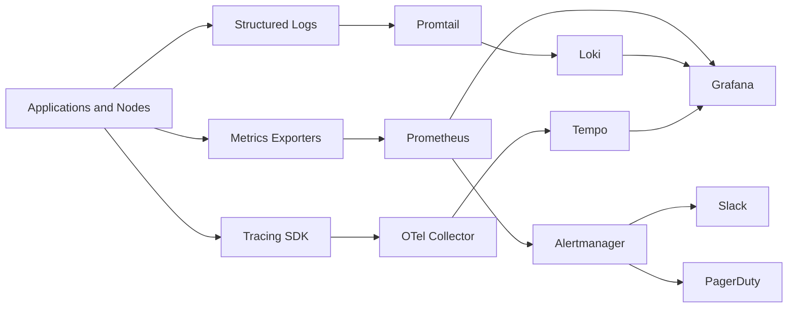

# Monitoring & Observability — Advanced Theory

## 1. Overview

Monitoring tells you **that something is wrong**.
Observability helps you understand **why it is wrong**, **where it is wrong**, and **what changed**.

In real production systems you need both.

A mature observability stack is not a single tool.
It is a telemetry pipeline that includes:

- instrumentation inside applications
- collection agents and exporters
- storage backends for metrics, logs, and traces
- dashboards for visualization
- alerting pipelines for response
- conventions for labels, routing, ownership, and runbooks

This module focuses on the modern open source stack:

- **Prometheus** for metrics
- **Alertmanager** for notifications and routing
- **Loki** for logs
- **Tempo / OpenTelemetry** for traces
- **Grafana** for visualization and correlation

---

## 2. Learning Objectives

After studying this theory, you should be able to:

- explain the three pillars of observability in depth
- choose the right telemetry type for a troubleshooting problem
- describe Prometheus internals and storage behavior
- use the four Prometheus metric types correctly
- write practical PromQL for dashboards, SLOs, and alerts
- design Alertmanager routing trees and inhibition logic
- build Loki label sets that avoid expensive queries
- explain trace propagation, spans, and sampling strategies
- understand Grafana architecture and alerting behavior
- compare Golden Signals, USE, and RED approaches
- recognize and prevent cardinality explosions
- avoid common monitoring anti-patterns

---

## 3. What Observability Really Means

Observability is the ability to infer internal system state from externally emitted telemetry.

A system is more observable when:

- telemetry is structured and consistent
- signals can be correlated across tools
- instrumentation follows stable naming conventions
- queries answer operational questions quickly
- alerts point to actionable symptoms
- dashboards reflect how users experience the system

Observability is not just “more dashboards”.
It is a design property of the system and its telemetry.

### 3.1 Monitoring vs Observability

| Concept | Main Question | Output |
|---|---|---|
| Monitoring | Is something broken? | Alerts, thresholds, health checks |
| Observability | Why is it broken? | Correlated metrics, logs, traces |
| Reliability engineering | How do we reduce recurrence? | SLOs, runbooks, automation |

### 3.2 Operational Maturity Model

A basic environment usually has:

- host CPU and memory graphs
- some logs on disk
- a few email alerts

An advanced environment adds:

- service-level SLIs and SLOs
- structured logs with trace correlation fields
- histograms for latency analysis
- recording rules for common queries
- routed alerts by ownership and severity
- exemplars linking metrics to traces
- long-term retention and federated views

---

## 4. End-to-End Telemetry Flow

### 4.1 High-Level Flow

```text
Application / Node / Kubernetes
        │
        ├── metrics ---> Prometheus ---> Alertmanager ---> Slack / PagerDuty / Email
        │
        ├── logs ------> Promtail -----> Loki ----------> Grafana Explore
        │
        └── traces ----> OTel Collector -> Tempo -------> Grafana Explore
                                                ▲
                                                │
                               Grafana dashboards / alerts / drill-down
```

### 4.2 Mermaid View



### 4.3 Why Correlation Matters

A single signal rarely solves incidents.

Typical workflow:

1. An alert says p99 latency is high.
2. Metrics show the spike started after a deployment.
3. A trace shows most time is spent in a downstream database span.
4. Logs from the same trace ID reveal connection pool exhaustion.
5. Capacity and connection limits are adjusted.

That is observability in practice.

---

## 5. The Three Pillars Deep Dive

The “three pillars” model is useful, even though modern practice often treats observability as a unified telemetry system rather than three isolated pillars.

Each signal type answers different questions.

### 5.1 Metrics

Metrics are numeric time series.
Each data point has:

- a metric name
- a timestamp
- a value
- a label set

Example:

```text
http_requests_total{service="checkout",method="POST",status="500"} 42
```

Metrics are best for:

- trend analysis
- capacity planning
- SLO burn-rate alerts
- dashboards
- fast aggregation across large fleets

Metrics are weak for:

- full request context
- ad-hoc event details
- debugging one specific request

#### Metrics strengths

- efficient storage
- fast aggregation
- ideal for alert evaluation
- good for percentiles when using histograms
- easy to compare across hosts, pods, services, and regions

#### Metrics limitations

- high-cardinality labels can destroy performance
- coarse aggregation can hide outliers
- counters reset on restart
- bad instrumentation makes analysis misleading

### 5.2 Logs

Logs are timestamped event records.
They can be:

- plain text
- structured JSON
- logfmt
- application-specific formats

Example JSON log:

```json
{
  "timestamp": "2025-01-10T10:00:00Z",
  "level": "error",
  "service": "checkout",
  "trace_id": "8f34c2...",
  "user_tier": "premium",
  "order_id": "ORD-12345",
  "message": "payment authorization failed",
  "status_code": 502
}
```

Logs are best for:

- detailed debugging
- audit trails
- security investigations
- deployment verification
- parsing application-specific failures

Logs are weak for:

- very fast aggregate alerting at large scale if badly indexed
- broad numerical trend analysis compared to metrics

#### Structured logging best practices

Always include consistent fields such as:

- timestamp
- severity
- service
- environment
- cluster
- namespace
- pod or instance
- request_id
- trace_id
- span_id when available
- message
- error_class or error_code

### 5.3 Traces

Traces model the path of a single request across distributed systems.

A trace contains:

- one **trace ID** for the full request
- multiple **spans** for individual operations
- parent-child relationships between spans
- timestamps, duration, attributes, events, and status

Traces are best for:

- latency debugging in microservices
- dependency analysis
- understanding retries and fan-out
- identifying which downstream step dominates latency

Traces are weak for:

- cheap long-term storage of every request without sampling
- global fleet-wide rate calculations compared to metrics

### 5.4 Pillar Comparison

| Signal | Best For | Common Storage Concern | Common Failure Mode |
|---|---|---|---|
| Metrics | Trends, alerts, SLOs | Cardinality | Too many label combinations |
| Logs | Event details, audits | Volume | Expensive indexing and noisy fields |
| Traces | Request path and latency breakdown | Sample size | Missing spans or poor propagation |

### 5.5 Pillars Working Together

```text
Metric spike  ---> tells you there is a problem
Trace sample ---> shows where time is spent
Logs         ---> explain what exactly failed
```

### 5.6 Example Incident Across All Three

Problem: checkout latency jumps from 200 ms to 3 s.

Metrics show:

- request rate normal
- error rate low
- p99 latency elevated only for `/payments/authorize`

Traces show:

- 2.6 s spent in `payment-gateway` span
- retries on outbound HTTPS call

Logs show:

- TLS handshake timeout errors
- upstream certificate rotation mismatch

Conclusion:

- metrics detected the user-facing symptom
- traces localized the slow dependency
- logs explained the exact failure mode

---

## 6. Golden Signals, USE, and RED

These are complementary mental models, not competing religions.

### 6.1 Golden Signals

Google SRE popularized four Golden Signals:

- **Latency**: how long requests take
- **Traffic**: how much demand exists
- **Errors**: how many requests fail
- **Saturation**: how full the system is

Golden Signals are service-focused and useful for dashboards and alerting.

### 6.2 USE Method

Brendan Gregg’s USE method focuses on resources:

- **Utilization**: percent of time a resource is busy
- **Saturation**: queued work waiting for the resource
- **Errors**: resource-level failures

USE works very well for infrastructure debugging.

Examples:

- CPU utilization, run queue, throttling
- disk utilization, IO queue depth, disk errors
- network interface saturation, drops, retransmits

### 6.3 RED Method

RED is common for request-serving systems:

- **Rate**: requests per second
- **Errors**: failed requests per second or error ratio
- **Duration**: latency distribution

RED is ideal for APIs, web services, and queues.

### 6.4 Comparison Table

| Method | Primary Target | Questions Answered | Best Fit |
|---|---|---|---|
| Golden Signals | User-facing service health | Are users impacted? | Service operations |
| USE | Infrastructure resources | Which resource is constrained? | Hosts, nodes, storage, network |
| RED | Request-serving systems | Is service throughput, error rate, or latency unhealthy? | APIs and microservices |

### 6.5 Practical Combination

A mature service dashboard often uses all three:

- Golden Signals for the service overview row
- RED for API-specific panels
- USE for nodes, containers, disks, and network dependencies

### 6.6 Example Mapping

| Concern | Golden Signals | RED | USE |
|---|---|---|---|
| API p99 latency | yes | duration | indirectly via saturation |
| 5xx error ratio | yes | errors | sometimes |
| CPU throttling | saturation | maybe | utilization + saturation |
| disk queue backlog | maybe | no | saturation |

---

## 7. Prometheus Architecture and Internals

Prometheus is a pull-based time-series monitoring system with a built-in TSDB, rule engine, and query language.

### 7.1 Core Architecture

```text
          Service Discovery
                │
                ▼
       ┌──────────────────┐
       │   Scrape Manager │
       └────────┬─────────┘
                │ HTTP GET /metrics
                ▼
        Exporters / Apps / Kubelets
                │
                ▼ samples
       ┌──────────────────┐
       │  WAL + Head Block│
       └────────┬─────────┘
                │ compaction
                ▼
       ┌──────────────────┐
       │ Persistent Blocks│
       └────────┬─────────┘
                │
      ┌─────────┴──────────┐
      ▼                    ▼
 Query Engine         Rule Engine
      │                    │
      ▼                    ▼
 Grafana             Alertmanager
```

### 7.2 Prometheus Pull Model

Prometheus usually scrapes targets over HTTP.

Typical endpoint:

```text
GET http://app:8080/metrics
```

#### Why pull is useful

- Prometheus controls scrape timing.
- Failed scrapes are visible as `up == 0`.
- Discovery can be centralized.
- Targets do not need to know where Prometheus lives.
- Service discovery systems can add and remove targets dynamically.

#### Pull model trade-offs

- targets must be reachable from Prometheus
- short-lived jobs may exit before scrape
- firewall and NAT rules may complicate scraping

For short-lived jobs, use one of these patterns:

- Pushgateway for batch job completion metrics
- write metrics to a file and export them through node exporter textfile collector
- instrument job success into a durable system

### 7.3 Scrape Lifecycle

A scrape job performs roughly these steps:

1. discover candidate targets
2. relabel target metadata
3. make HTTP request to metrics endpoint
4. parse exposition format
5. apply metric relabeling
6. append samples to WAL and head block
7. update internal scrape metrics

### 7.4 Service Discovery

Prometheus supports service discovery for environments like:

- Kubernetes
- Consul
- EC2
- GCE
- Azure
- static targets

In Kubernetes, metadata becomes internal labels such as:

- `__meta_kubernetes_namespace`
- `__meta_kubernetes_pod_name`
- `__meta_kubernetes_service_label_app`

These labels are then transformed by relabeling rules.

### 7.5 Relabeling vs Metric Relabeling

#### `relabel_configs`

Used before scraping to modify target labels.

Common uses:

- keep only desired services
- rewrite target address
- map Kubernetes labels into Prometheus labels
- drop noisy targets entirely

#### `metric_relabel_configs`

Used after scraping to drop or rewrite metrics.

Common uses:

- drop high-cardinality labels
- drop entire metrics that are not needed
- rename labels for consistency

Example:

```yaml
metric_relabel_configs:
  - source_labels: [pod]
    regex: 'job-[0-9a-f]{16,}'
    action: drop
```

### 7.6 TSDB Basics

Prometheus stores data as time series.
A time series is uniquely defined by:

- metric name
- full label set

Example:

```text
http_requests_total{service="api",method="GET",status="200"}
```

If you add another label value, you create a different series.

### 7.7 Head Block and WAL

New samples are first written to:

- the **WAL** for crash recovery
- the in-memory **head block** for recent data and active queries

WAL stands for **Write-Ahead Log**.

Purpose of WAL:

- durability across crashes
- replay into memory on restart
- decouple ingestion from compaction

Operational implications:

- disk must handle sustained sequential writes
- restarts replay WAL and can take time on large servers
- corrupted WAL can delay recovery

### 7.8 Blocks, Chunks, and Indexes

Prometheus periodically compacts data from the head block into immutable blocks.

Each block includes:

- chunks of compressed samples
- index for label lookup
- metadata file
- tombstones for deleted series

Typical block duration starts at 2 hours.

Chunks store multiple samples efficiently.
Compression is one reason Prometheus handles huge sample volumes well.

### 7.9 Retention

Retention can be controlled by time and/or size.

Common flags:

```text
--storage.tsdb.retention.time=15d
--storage.tsdb.retention.size=100GB
```

If both are set, whichever limit is hit first wins.

Short retention is common for local Prometheus when long-term storage exists elsewhere.

### 7.10 TSDB Compaction

Compaction merges smaller blocks into larger ones.

Why compaction matters:

- improves query efficiency
- reduces metadata overhead
- applies retention and tombstones

Symptoms of compaction trouble:

- high disk IO
- increasing block count
- failed compaction logs
- long startup or shutdown times

### 7.11 Remote Write

`remote_write` streams samples to external backends such as:

- Thanos Receive
- Grafana Mimir
- Cortex
- VictoriaMetrics
- managed cloud backends

Common reasons to use remote write:

- long-term retention
- central multi-cluster storage
- horizontal scalability
- global dashboards across regions

Operational concerns:

- queue backpressure
- failed sends during network issues
- remote endpoint throttling
- high memory if queues grow

Important metrics:

- `prometheus_remote_storage_samples_pending`
- `prometheus_remote_storage_failed_samples_total`
- `prometheus_remote_storage_shards`
- `prometheus_remote_storage_queue_highest_sent_timestamp_seconds`

### 7.12 Remote Read

`remote_read` lets Prometheus query data from an external backend.

It is less commonly emphasized than remote write because:

- it can increase query latency
- many teams query long-term data directly through Grafana and a backend like Thanos or Mimir

### 7.13 Federation

Federation is different from remote write.

A higher-level Prometheus scrapes a lower-level Prometheus using `/federate`.

Good uses:

- aggregate selected high-level series from many clusters
- preserve local autonomy while exposing global dashboards

Bad uses:

- sending every raw series upward
- replacing proper long-term storage at scale

### 7.14 Prometheus HA Patterns

Prometheus itself is not a strongly consistent distributed database.
High availability is usually achieved by running two identical scrapers.

Pattern:

- Prometheus A scrapes targets
- Prometheus B scrapes same targets
- Grafana / Thanos deduplicates for queries
- Alertmanager deduplicates alerts from both

This protects against:

- node failure
- process crash
- rolling upgrades

### 7.15 Prometheus Internal Metrics

Prometheus exposes important self-metrics.
Examples:

```promql
prometheus_tsdb_head_series
prometheus_tsdb_head_samples_appended_total
prometheus_tsdb_wal_fsync_duration_seconds
prometheus_engine_query_duration_seconds
prometheus_rule_evaluation_failures_total
prometheus_remote_storage_failed_samples_total
```

These should be part of your observability stack.
You must monitor the monitor.

### 7.16 WAL and Crash Recovery Summary

```text
sample arrives
   ↓
append to WAL
   ↓
update head block
   ↓
serve recent queries
   ↓
compact to block
   ↓
apply retention later
```

### 7.17 Retention Strategy Guidelines

For local cluster Prometheus:

- 7d to 15d is common
- use SSD-backed PVCs
- remote write critical metrics to long-term storage

For large enterprise setups:

- keep short retention locally for speed
- centralize long-term metrics in Mimir or Thanos
- use recording rules to precompute expensive fleet-wide queries

---

## 8. Prometheus Metric Types

Prometheus has four classic metric types exposed by clients.

### 8.1 Counter

A counter only goes up, except when it resets after restart.

Use a counter for:

- requests served
- errors encountered
- jobs completed
- retries attempted
- bytes sent

Example:

```text
http_requests_total{service="checkout",status="200"}
```

Common PromQL:

```promql
rate(http_requests_total[5m])
increase(http_requests_total[1h])
```

Do not use a counter for current values such as queue depth or memory usage.

### 8.2 Gauge

A gauge goes up and down.

Use a gauge for:

- temperature
- current memory usage
- active sessions
- queue length
- in-flight requests

Examples:

```text
process_resident_memory_bytes
queue_depth
http_in_flight_requests
```

Gauges are easy to misuse.
Ask whether the value is a current state or a cumulative event count.

### 8.3 Histogram

A histogram records observations into buckets and also exposes:

- `_bucket`
- `_sum`
- `_count`

Use a histogram for:

- request latency
- payload size
- batch duration
- query response size

Example series:

```text
http_request_duration_seconds_bucket{le="0.1"}
http_request_duration_seconds_bucket{le="0.5"}
http_request_duration_seconds_bucket{le="1"}
http_request_duration_seconds_sum
http_request_duration_seconds_count
```

With histograms you can compute percentiles centrally in PromQL.

Example p99:

```promql
histogram_quantile(
  0.99,
  sum(rate(http_request_duration_seconds_bucket[5m])) by (le, service)
)
```

Why histograms are usually preferred over summaries for server-side latency:

- percentiles can be aggregated across instances
- bucket-based alerts and SLO math are possible
- recording rules can precompute them centrally

### 8.4 Summary

A summary calculates quantiles on the client side and exposes:

- quantile series
- `_sum`
- `_count`

Use a summary when:

- you only need local instance quantiles
- central aggregation is not required
- client-side computation cost is acceptable

Problem with summaries:

- quantiles from different instances cannot be aggregated meaningfully

Bad pattern:

```promql
avg(http_request_duration_seconds{quantile="0.99"})
```

That is not a true global p99.

### 8.5 Metric Type Selection Guide

| Need | Recommended Type |
|---|---|
| Total number of events over time | Counter |
| Current point-in-time value | Gauge |
| Percentiles and distribution | Histogram |
| Local quantiles only | Summary |

### 8.6 Real Examples

#### Example: API requests

- `http_requests_total` -> counter
- `http_in_flight_requests` -> gauge
- `http_request_duration_seconds` -> histogram

#### Example: Worker queue

- `jobs_processed_total` -> counter
- `queue_depth` -> gauge
- `job_processing_duration_seconds` -> histogram

#### Example: Database client

- `db_queries_total` -> counter
- `db_connections_active` -> gauge
- `db_query_duration_seconds` -> histogram

### 8.7 Native Histograms

Modern Prometheus versions support native histograms.
They reduce some traditional histogram trade-offs and can improve percentile accuracy and storage efficiency in some cases.

You still need careful rollout because:

- tooling compatibility matters
- storage cost still depends on volume
- query behavior differs from classic buckets

### 8.8 Metric Naming Best Practices

Good names are:

- lowercase
- underscore separated
- unit-suffixed where relevant
- pluralized where appropriate for totals

Examples:

- `http_requests_total`
- `node_memory_MemAvailable_bytes`
- `http_request_duration_seconds`
- `process_cpu_seconds_total`

Avoid names like:

- `requestCounter`
- `responseTimeMsHistogramThing`
- `cpuUsageNow`

### 8.9 Label Design Best Practices

Good labels are bounded and meaningful.

Good examples:

- `service`
- `namespace`
- `method`
- `status_code`
- `region`
- `cluster`

Bad examples:

- `user_id`
- `session_id`
- `request_id`
- `email`
- `full_path` when path contains dynamic IDs

---

## 9. PromQL Deep Dive

PromQL is a functional query language for time series.

### 9.1 PromQL Data Types

PromQL works with:

- **instant vectors**
- **range vectors**
- **scalars**
- **strings** in limited contexts

Examples:

```promql
up
rate(http_requests_total[5m])
5
```

### 9.2 Selectors

#### Exact match

```promql
up{job="api"}
```

#### Regex match

```promql
http_requests_total{status_code=~"5.."}
```

#### Negative match

```promql
up{namespace!="kube-system"}
```

#### Negative regex

```promql
up{pod!~"job-.*"}
```

### 9.3 Range Selectors

Use range selectors for functions that need historical samples.

```promql
rate(http_requests_total[5m])
increase(http_requests_total[1h])
avg_over_time(queue_depth[15m])
```

### 9.4 Offsets and Subqueries

Offset lets you compare to previous periods.

```promql
rate(http_requests_total[5m] offset 1h)
```

Subqueries let one range function feed another.

```promql
max_over_time(rate(http_requests_total[1m])[30m:1m])
```

### 9.5 Arithmetic Operators

PromQL supports:

- `+`
- `-`
- `*`
- `/`
- `%`
- `^`

Example error ratio:

```promql
sum(rate(http_requests_total{status_code=~"5.."}[5m]))
/
sum(rate(http_requests_total[5m]))
```

### 9.6 Comparison Operators

PromQL supports:

- `==`
- `!=`
- `>`
- `<`
- `>=`
- `<=`

Example:

```promql
up == 0
```

### 9.7 Logical and Set Operators

PromQL also has:

- `and`
- `or`
- `unless`

Example:

```promql
up == 0 unless on(instance) maintenance_mode == 1
```

### 9.8 Aggregation Operators

Important aggregations include:

- `sum`
- `avg`
- `min`
- `max`
- `count`
- `count_values`
- `stddev`
- `stdvar`
- `bottomk`
- `topk`
- `quantile`

Examples:

```promql
sum(rate(http_requests_total[5m])) by (service)
avg(node_load1) by (instance)
max(container_memory_working_set_bytes) by (pod)
count(up == 0) by (job)
topk(5, sum(rate(container_cpu_usage_seconds_total[5m])) by (pod))
```

### 9.9 Grouping Modifiers

Use `by (...)` to keep labels.
Use `without (...)` to remove labels.

Examples:

```promql
sum(rate(http_requests_total[5m])) by (service, status_code)
sum(rate(http_requests_total[5m])) without (instance, pod)
```

### 9.10 Vector Matching

When combining vectors, labels must match.

Useful modifiers:

- `on(...)`
- `ignoring(...)`
- `group_left`
- `group_right`

Example:

```promql
sum(rate(container_cpu_usage_seconds_total[5m])) by (pod, namespace)
* on(pod, namespace) group_left(node)
kube_pod_info
```

This attaches node metadata to CPU usage.

### 9.11 Core Functions You Must Know

#### `rate()`

Use for counters over a range.
Best default for alerts and dashboards.

```promql
rate(http_requests_total[5m])
```

#### `irate()`

Uses the last two points only.
More responsive, more noisy.
Better for dashboards than alerts.

```promql
irate(http_requests_total[5m])
```

#### `increase()`

Total increase across the range.
Good for reports and totals.

```promql
increase(http_requests_total[1h])
```

#### `histogram_quantile()`

Used with histogram buckets.
Computes estimated percentile.

```promql
histogram_quantile(
  0.95,
  sum(rate(http_request_duration_seconds_bucket[5m])) by (le, service)
)
```

#### `topk()`

Returns the top K series by value.

```promql
topk(10, sum(rate(container_cpu_usage_seconds_total[5m])) by (pod))
```

#### `absent()`

Returns a vector when no series exist.
Great for heartbeat checks and missing targets.

```promql
absent(up{job="payments"})
```

### 9.12 Additional Useful Functions

```promql
sum_over_time(errors_total[30m])
avg_over_time(queue_depth[15m])
max_over_time(node_load1[1h])
min_over_time(available_replicas[1h])
changes(kube_deployment_status_observed_generation[10m])
resets(process_start_time_seconds[1h])
predict_linear(node_filesystem_free_bytes[6h], 4 * 3600)
label_replace(up, "node", "$1", "instance", "([^:]+):.*")
```

### 9.13 Counter Queries: Common Rules

- always use `rate`, `irate`, or `increase` with counters
- do not graph raw counters for rates
- be aware of restarts and resets
- use windows long enough to smooth noise

### 9.14 Gauge Queries: Common Rules

- direct gauge graphing is okay
- range functions like `avg_over_time` are often useful
- gauge alerts often need `for:` to avoid flapping

### 9.15 Histogram Query Patterns

#### Request rate from histogram count

```promql
sum(rate(http_request_duration_seconds_count[5m])) by (service)
```

#### Average latency from histogram sum and count

```promql
sum(rate(http_request_duration_seconds_sum[5m])) by (service)
/
sum(rate(http_request_duration_seconds_count[5m])) by (service)
```

#### p99 latency

```promql
histogram_quantile(
  0.99,
  sum(rate(http_request_duration_seconds_bucket[5m])) by (service, le)
)
```

### 9.16 PromQL for Golden Signals

#### Traffic

```promql
sum(rate(http_requests_total{service="checkout"}[5m]))
```

#### Errors

```promql
sum(rate(http_requests_total{service="checkout",status_code=~"5.."}[5m]))
/
sum(rate(http_requests_total{service="checkout"}[5m]))
```

#### Latency

```promql
histogram_quantile(
  0.95,
  sum(rate(http_request_duration_seconds_bucket{service="checkout"}[5m])) by (le)
)
```

#### Saturation

```promql
sum(rate(container_cpu_usage_seconds_total{namespace="checkout"}[5m])) by (pod)
```

### 9.17 Recording Rules

Recording rules precompute frequently used expressions.

Benefits:

- faster dashboards
- more stable alerts
- less repeated expensive computation
- easier naming for SLI and SLO queries

Example:

```yaml
groups:
  - name: service-recording.rules
    interval: 30s
    rules:
      - record: job:http_requests:rate5m
        expr: sum(rate(http_requests_total[5m])) by (job, namespace)

      - record: job:http_errors:rate5m
        expr: sum(rate(http_requests_total{status_code=~"5.."}[5m])) by (job, namespace)

      - record: job:http_error_ratio:rate5m
        expr: job:http_errors:rate5m / job:http_requests:rate5m

      - record: job:http_latency_p99:5m
        expr: |
          histogram_quantile(
            0.99,
            sum(rate(http_request_duration_seconds_bucket[5m])) by (job, namespace, le)
          )
```

### 9.18 Alert Query Patterns

Good alert queries:

- aggregate away noisy dimensions
- align with ownership
- use reasonable time windows
- avoid one alert per pod if team only acts at service level
- use `for:` to filter transient blips

Bad alert example:

```promql
container_cpu_usage_seconds_total > 0.9
```

Why it is bad:

- raw counter misuse
- no rate
- no aggregation
- no duration

Better:

```promql
sum(rate(container_cpu_usage_seconds_total{namespace="prod"}[5m])) by (pod)
> 0.9
```

### 9.19 SLO Query Example

Availability SLI for requests:

```promql
1 - (
  sum(rate(http_requests_total{job="api",status_code=~"5.."}[5m]))
  /
  sum(rate(http_requests_total{job="api"}[5m]))
)
```

### 9.20 PromQL Mistakes to Avoid

- averaging percentiles from summaries
- using `irate` for noisy paging alerts
- alerting on raw counters
- using too-short windows for low-traffic services
- querying every pod label on every panel
- forgetting vector matching rules

---

## 10. Alertmanager Deep Dive

Alertmanager receives alerts from Prometheus, groups them, routes them, deduplicates them, manages silences, and sends notifications.

### 10.1 Notification Flow

```text
Prometheus rule fires
      ↓
Alert sent with labels + annotations
      ↓
Alertmanager groups matching alerts
      ↓
Routing tree picks receiver(s)
      ↓
Inhibition and silence rules apply
      ↓
Template renders message
      ↓
Slack / PagerDuty / Email / Webhook
```

### 10.2 Alerts Contain Two Kinds of Data

#### Labels

Labels determine routing, grouping, and inhibition.
Examples:

- `alertname`
- `severity`
- `team`
- `service`
- `cluster`
- `namespace`

#### Annotations

Annotations explain the alert to humans.
Examples:

- summary
- description
- runbook URL
- dashboard URL
- ticket hint

### 10.3 Routing Tree

Alertmanager routing is hierarchical.
Each alert enters at the top route and traverses child routes.

Example:

```yaml
route:
  receiver: default-slack
  group_by: [alertname, cluster, service]
  group_wait: 30s
  group_interval: 5m
  repeat_interval: 4h
  routes:
    - matchers:
        - severity="critical"
      receiver: pagerduty-critical
      continue: true
    - matchers:
        - severity="critical"
      receiver: slack-critical
    - matchers:
        - team="platform"
      receiver: slack-platform
```

### 10.4 Grouping

Grouping reduces alert storms.

Important fields:

- `group_by`
- `group_wait`
- `group_interval`
- `repeat_interval`

Meaning:

- **group_wait**: initial delay before first notification to allow related alerts to join
- **group_interval**: wait before sending updates to the same group
- **repeat_interval**: resend if still firing later

### 10.5 Silences

Silences mute alerts temporarily.

Use silences for:

- maintenance windows
- controlled migrations
- noisy known incidents already under active handling

Avoid using silences to hide bad alert design.

### 10.6 Inhibition

Inhibition suppresses downstream alerts when a higher-level cause is already firing.

Example:

- if `NodeDown` is firing, suppress `PodNotReady` and `PodCrashLooping` on that node

Example rule:

```yaml
inhibit_rules:
  - source_matchers:
      - alertname="NodeDown"
    target_matchers:
      - alertname=~"PodNotReady|PodCrashLooping"
    equal: [cluster, node]
```

### 10.7 Why Inhibition Matters

Without inhibition:

- a node outage might generate 200 pod alerts
- responders get flooded with duplicate symptoms
- noise delays identification of root cause

### 10.8 Templates

Alertmanager templates format messages.

Good notifications include:

- alert name
- severity
- service/team
- short summary
- likely impact
- direct runbook link
- dashboard link
- silence link if appropriate

Slack example snippet:

```yaml
receivers:
  - name: slack-critical
    slack_configs:
      - channel: '#sre-critical'
        send_resolved: true
        title: '🔴 {{ .GroupLabels.alertname }}'
        text: |
          {{ range .Alerts }}
          *Service:* {{ .Labels.service }}
          *Summary:* {{ .Annotations.summary }}
          *Runbook:* {{ .Annotations.runbook_url }}
          {{ end }}
```

### 10.9 HA Mode

Alertmanager can run in HA mode with mesh/gossip coordination.

Why HA matters:

- avoids notification loss during restart or node failure
- supports rolling upgrades
- deduplicates notifications across instances

Practical pattern in Kubernetes:

- run 2 or 3 Alertmanager replicas
- put them behind a stable service
- use persistent storage if required by deployment mode

### 10.10 Pager Escalation Design

Critical alerts should be:

- few in number
- actionable
- directly tied to user or business impact
- routed by team ownership

Warning alerts should generally:

- go to chat
- create awareness
- not page by default

Info alerts should often:

- go to dashboards or ticket queues
- not interrupt humans

### 10.11 Alert Labels You Usually Want

- `severity`
- `team`
- `service`
- `environment`
- `cluster`
- `namespace`
- `runbook`

### 10.12 Alertmanager Anti-Patterns

- one receiver for every alert regardless of team
- paging on warning-level alerts
- no grouping
- no inhibition
- no runbook URLs
- notifying on infrastructure symptoms nobody can act on
- putting secrets directly in config files instead of secret refs

---

## 11. Loki Architecture and LogQL

Loki is a log aggregation system designed around **cheap log storage** and **small indexes**.

Unlike classic full-text log backends, Loki indexes labels, not entire log bodies.

### 11.1 Why Loki Feels Different

Loki’s core design idea:

- keep indexes small
- store compressed log chunks cheaply
- query logs by labels first, then filter content

That makes label design extremely important.

### 11.2 Loki Push Model

Prometheus mostly pulls metrics.
Loki mostly receives pushed logs from agents such as:

- Promtail
- Grafana Agent / Alloy
- Fluent Bit
- OpenTelemetry Collector

Log shippers tail files or collect container stdout and push streams to Loki.

### 11.3 Loki Components

```text
Promtail / Agent
      ↓
 Distributor
      ↓
  Ingesters
      ↓
Object storage + index
      ↓
Querier / Query Frontend / Ruler
      ↓
Grafana
```

### 11.4 Core Components Explained

#### Distributor

- receives pushed log streams
- validates labels and tenant info
- shards streams to ingesters

#### Ingester

- keeps recent log streams in memory
- groups logs into chunks
- flushes chunks to object storage
- may write WAL for durability

#### Chunks

A chunk is a compressed block of log entries for a stream.
A stream is defined by an exact label set.

#### Compactor

The compactor handles:

- retention enforcement
- index compaction
- deleting expired data
- query efficiency improvements

#### Query Frontend and Querier

- split and parallelize queries
- cache results
- execute LogQL against chunks and indexes

### 11.5 Loki Stream Identity

A unique label set defines a stream.

Example stream labels:

```text
{cluster="prod-a",namespace="payments",app="checkout",container="api"}
```

If you add `trace_id` as a label, every request could create a new stream.
That is disastrous.

### 11.6 Label Design Principles

Use labels that are:

- bounded
- operationally meaningful
- stable over time
- useful for primary filtering

Good Loki labels:

- cluster
- environment
- namespace
- app
- container
- pod only when acceptable
- level if it is bounded and useful

Bad Loki labels:

- request_id
n- trace_id as a primary label
- user_id
- email
- session_id
- full URL with IDs
- raw error message text

### 11.7 Important Loki Trade-Off

If a field has many unique values, it usually belongs in the log body, not the label set.

Best pattern:

- keep `trace_id` in log content
- define a derived field in Grafana
- click from logs to traces without indexing it as a label

### 11.8 LogQL Basics

LogQL has two broad styles:

- log queries
- metric queries derived from logs

#### Basic stream selector

```logql
{namespace="payments", app="checkout"}
```

#### Simple content filters

```logql
{app="checkout"} |= "ERROR"
{app="checkout"} != "healthcheck"
{app="checkout"} |~ "timeout|connection reset"
```

### 11.9 Parsing Pipelines

#### JSON parser

```logql
{app="checkout"} | json | level="error" | status_code >= 500
```

#### logfmt parser

```logql
{app="worker"} | logfmt | level="warn"
```

#### Regex parser

```logql
{app="nginx"} | regexp `status=(?P<status>[0-9]{3}) path=(?P<path>\S+)`
```

#### Line formatting

```logql
{app="checkout"} | json | line_format "{{.method}} {{.path}} => {{.status_code}}"
```

### 11.10 Metric Queries from Logs

Count errors over time:

```logql
count_over_time({app="checkout"} |= "ERROR" [5m])
```

Error rate by app:

```logql
sum(rate({namespace="prod"} |= "ERROR" [5m])) by (app)
```

Top failing messages:

```logql
topk(5, sum(count_over_time({app="checkout"} |= "ERROR" [30m])) by (message))
```

JSON status-based rate:

```logql
sum(rate({app="checkout"} | json | status_code >= 500 [5m]))
```

### 11.11 Log-Based SLOs

You can derive SLOs from logs when metrics are missing or incomplete.

Example success ratio from access logs:

```logql
1 - (
  sum(rate({app="nginx"} | json | status >= 500 [5m]))
  /
  sum(rate({app="nginx"} | json [5m]))
)
```

This is useful, but native metrics are usually cheaper and more reliable for high-volume SLOs.

### 11.12 Loki Ruler and Alerting

Loki can evaluate recording and alerting rules.
Grafana unified alerting can also query Loki directly.

Use log-based alerts for:

- rare but important error signatures
- missing audit events
- auth failures
- exceptions not exposed by metrics

### 11.13 Loki Anti-Patterns

- indexing dynamic fields as labels
- shipping duplicate logs from multiple agents
- storing every debug log forever
- parsing huge unstructured lines at query time only
- using logs instead of metrics for every high-frequency KPI

---

## 12. Distributed Tracing Deep Dive

Distributed tracing follows a request across services and infrastructure boundaries.

### 12.1 Core Terms

#### Trace

The full request journey.

#### Span

A timed unit of work within a trace.
Examples:

- HTTP request handler
- SQL query
- cache lookup
- remote gRPC call

#### Parent and Child Spans

A parent span can contain one or more child spans.
This shows call hierarchy and concurrency.

#### Trace ID

A globally unique identifier for the entire trace.

#### Span ID

A unique identifier for a single span.

### 12.2 Trace Structure

```text
Trace: checkout request
└── HTTP /checkout
    ├── inventory-service call
    ├── pricing-service call
    ├── payment-service call
    │   └── payment-gateway HTTPS call
    └── postgres INSERT order
```

### 12.3 Why Traces Matter

Metrics might tell you:

- p99 latency is 4 seconds

A trace tells you:

- 3.2 seconds were spent in the payment gateway call
- 600 ms were spent waiting for a DB lock
- retries created the extra latency

### 12.4 OpenTelemetry

OpenTelemetry is the standard framework for generating and exporting telemetry.

It provides:

- APIs for instrumentation
- SDKs for apps
- semantic conventions
- OTLP protocol
- Collector pipelines

### 12.5 OpenTelemetry Pipeline

```text
Application SDK
      ↓
OTLP exporter
      ↓
OpenTelemetry Collector
      ↓
Backend: Tempo / Jaeger / vendor
```

The Collector can:

- receive telemetry
- batch it
- enrich it
- sample it
- route it
- export it to multiple backends

### 12.6 Context Propagation

Traces only work across services when context propagates correctly.

Common standard:

- W3C Trace Context header: `traceparent`

Without propagation:

- traces break at service boundaries
- parent-child relationships disappear
- correlation becomes incomplete

### 12.7 Span Attributes and Events

Useful span attributes include:

- `service.name`
- `http.method`
- `http.route`
- `http.status_code`
- `db.system`
- `db.operation`
- `messaging.system`
- `net.peer.name`

Events capture important moments inside spans such as:

- retry started
- timeout reached
- cache miss
- validation failed

### 12.8 Sampling Strategies

Tracing every request forever is often too expensive.
Sampling controls cost.

#### Head-based sampling

Decision is made near the beginning of a trace.

Pros:

- simple
- efficient
- low backend load

Cons:

- rare bad traces may be dropped before their importance is known

#### Tail-based sampling

Decision is made after seeing the completed trace.

Pros:

- keep slow or error traces preferentially
- much better for incident debugging

Cons:

- more infrastructure cost
- buffering required
- more complex collector pipelines

#### Parent-based sampling

Child spans follow the parent decision.
Useful for consistency across services.

### 12.9 Tail-Based Sampling Example Policies

Useful keep rules:

- always keep errors
- keep traces above 2 seconds
- keep 100% of checkout/payment traces
- sample 1% of healthy low-latency traces

### 12.10 Exemplars

Exemplars are trace references attached to metric samples.

They are extremely powerful because they let you:

- see a latency spike on a graph
- click the exemplar dot
- open the exact representative trace

This is one of the best bridges between metrics and traces.

### 12.11 Tempo Notes

Tempo is Grafana’s trace backend.

Key characteristics:

- object-storage friendly
- minimal indexing compared with some older tracing systems
- integrates tightly with Grafana Explore
- supports TraceQL for querying traces

### 12.12 Common Tracing Problems

- missing propagation headers
- inconsistent service names
- too many span attributes with unbounded values
- no batching in exporter
- dropping traces during collector overload
- no sampling strategy tied to incident needs

---

## 13. Grafana Architecture and Capabilities

Grafana is the visualization and correlation layer in many observability stacks.

### 13.1 Core Architecture

```text
Browser
  ↓
Grafana UI + API
  ↓
Datasource plugins
  ├── Prometheus
  ├── Loki
  ├── Tempo
  ├── Elasticsearch
  └── cloud providers
  ↓
Dashboards / Explore / Alerting / Annotations
```

### 13.2 What Grafana Stores

Grafana typically stores:

- dashboards
- folders
- users and teams
- alerting rules and contact points
- datasource configuration
- notification policies
- annotations metadata

Depending on deployment, it uses:

- SQLite
- MySQL
- PostgreSQL

### 13.3 Datasources

A datasource defines how Grafana queries a backend.

Common observability datasources:

- Prometheus for metrics
- Loki for logs
- Tempo for traces
- Elasticsearch for logs and search
- Cloud Monitoring / CloudWatch / Azure Monitor

Stable datasource UIDs matter for dashboard portability.

### 13.4 Explore Mode

Grafana Explore is designed for ad-hoc debugging.

Useful features:

- query history
- metrics/logs/traces switching
- log context view
- derived fields
- exemplars
- split view comparison

### 13.5 Transformations

Transformations let you reshape query output.

Common transformations:

- join fields
- merge tables
- organize fields
- calculate new field
- filter by value
- rename by regex
- group by

These are useful when building executive or operations dashboards from multiple query results.

### 13.6 Panel Types

Common panel types and good use cases:

- **Time series**: trends, rates, percentile graphs
- **Stat**: single KPI, current SLO, target health count
- **Table**: top errors, pod inventory, alert summaries
- **Heatmap**: latency distributions
- **Bar gauge**: compare pods or services at a glance
- **Logs**: live or historical logs
- **State timeline**: deploy windows and alert state changes

### 13.7 Variables

Variables make dashboards reusable.

Typical chained variables:

- cluster
- namespace
- service or workload
- pod

Good variable design rules:

- keep top-level filters stable
- avoid overly expensive variable queries
- use regex and multi-select carefully
- prefer recorded metrics for huge environments

### 13.8 Annotations

Annotations mark events on dashboards.

Typical annotations:

- deployments
- incident start/end times
- config rollouts
- feature flag changes
- maintenance windows

Annotations improve change correlation.

### 13.9 Grafana Alerting Engine

Grafana’s unified alerting supports:

- alert rules
- contact points
- notification policies
- mute timings
- silences

It can query multiple backends, including:

- Prometheus
- Loki
- cloud monitoring systems

### 13.10 Grafana vs Prometheus Alerting

Prometheus alerting:

- native for Prometheus metrics
- rule files live close to metric definitions
- excellent for cluster-native metric alerts

Grafana alerting:

- multi-datasource
- UI-managed or provisioned
- good for logs, cloud data, and cross-source use cases

Many teams use both.

### 13.11 Dashboard Design Principles

A good dashboard:

- starts with user impact
- shows a summary before details
- uses consistent units
- includes thresholds or SLO targets
- supports drill-down to logs or traces
- avoids visual clutter

A bad dashboard:

- has 40 tiny graphs no one can interpret
- shows raw counters everywhere
- mixes units inconsistently
- lacks ownership or service context

---

## 14. Cardinality Problems and How to Avoid Them

Cardinality is the number of unique series or streams generated by label combinations.

### 14.1 Why Cardinality Hurts

In Prometheus, every unique label set becomes a distinct time series.
In Loki, every unique label set becomes a distinct stream.

Explosions in either system increase:

- memory usage
- index size
- query latency
- compaction load
- remote write cost
- alert evaluation cost

### 14.2 Simple Cardinality Math

Suppose a metric has these labels:

- 50 services
- 10 HTTP methods or operations
- 20 status codes
- 200 pods

Potential series count:

```text
50 × 10 × 20 × 200 = 2,000,000 series
```

And that is before adding region, cluster, or tenant.

### 14.3 Dangerous Label Examples

In metrics, dangerous labels include:

- request_id
- user_id
- cart_id
- full URL with IDs
- build SHA if it changes constantly per pod

In logs, dangerous labels include:

- trace_id
- session_id
- email
- exception text
- dynamic query string values

### 14.4 Symptoms of High Cardinality in Prometheus

- `prometheus_tsdb_head_series` grows rapidly
- Prometheus memory usage spikes
- WAL replay becomes slow
- queries time out
- remote write queues back up
- rule evaluation slows down

### 14.5 Symptoms of High Cardinality in Loki

- too many active streams
- ingester memory pressure
- frequent chunk flushing
- slow queries even with narrow time windows
- large index and object storage overhead

### 14.6 Cardinality Detection Queries

Top metric names by series count:

```promql
topk(20, count by (__name__)({__name__=~".+"}))
```

Series count for one metric:

```promql
count(http_requests_total)
```

Possible noisy label combinations:

```promql
count by (path) (http_requests_total)
```

### 14.7 Prevention Strategies

- label routes, not full URLs
- use normalized resource names
- drop unbounded labels with metric relabeling
- use recording rules to pre-aggregate
- review instrumentation before production rollout
- set resource alerts on the observability platform itself

### 14.8 Metric Design Example

Bad:

```text
http_requests_total{path="/users/938472/orders/12345"}
```

Good:

```text
http_requests_total{route="/users/:id/orders/:id"}
```

### 14.9 Loki Design Example

Bad labels:

```text
{app="api",trace_id="abc123",user_id="42"}
```

Good labels plus rich body:

```text
labels: {app="api",namespace="prod",level="error"}
body: {"trace_id":"abc123","user_id":"42","message":"payment failed"}
```

---

## 15. Monitoring Anti-Patterns

Advanced systems still fail when the monitoring culture is poor.

### 15.1 Alerting on Symptoms Nobody Can Act On

Example:

- every transient pod restart pages the on-call even when autoscaling heals it

Fix:

- alert at service impact level
- include ownership and runbook
- reserve paging for actionable conditions

### 15.2 Alerting on Everything

Too many alerts cause alert fatigue.
People stop trusting the system.

Fix:

- classify alerts by severity
- review noisy alerts monthly
- delete useless alerts

### 15.3 No SLO Context

Without SLOs, teams often alert on arbitrary thresholds.

Fix:

- define user-facing SLIs
- use burn-rate alerts where appropriate
- align alerting with error budget risk

### 15.4 Only Host Metrics, No Service Metrics

CPU and memory are not enough.
A service can be down while nodes look healthy.

Fix:

- instrument request rate, errors, latency, queue depth, and dependency metrics

### 15.5 No Structured Logging

Searching raw strings across huge volumes is slow and fragile.

Fix:

- log JSON or logfmt
- include stable fields and correlation IDs

### 15.6 No Trace Propagation

You cannot debug distributed latency if every service starts a fresh trace.

Fix:

- propagate W3C trace headers end to end
- test propagation in staging

### 15.7 Dashboard Clutter

A dashboard with dozens of panels and no narrative is not helpful.

Fix:

- create overview, drill-down, and component dashboards separately
- lead with Golden Signals

### 15.8 Metrics With Unbounded Labels

This is one of the most expensive mistakes in observability.

Fix:

- review instrumentation libraries
- normalize routes and resource names
- forbid request IDs in labels

### 15.9 Missing Monitoring for the Monitoring Stack

If Prometheus, Loki, or Alertmanager fail silently, you lose visibility exactly when you need it.

Fix:

- monitor ingestion rate, storage, target health, rule failures, queue backlogs, and notification failures

### 15.10 Manual-Only Dashboards

If dashboards only live in the UI, drift becomes inevitable.

Fix:

- provision dashboards as code
- version JSON or provisioning manifests in Git

### 15.11 No Runbooks in Alerts

An alert without next steps increases MTTR.

Fix:

- include summary, impact, and runbook link in annotations

### 15.12 Using Logs for High-Rate Metrics

Logs can derive metrics, but using them for every KPI is expensive and slow.

Fix:

- emit native metrics for rates, latencies, and resource saturation
- use logs for deep context and rare signatures

---

## 16. Practical Query and Design Patterns

### 16.1 Service Health Starter Set

At minimum, instrument:

- request rate
- error rate
- request duration histogram
- in-flight requests
- downstream dependency errors
- queue depth if async
- worker lag if consumer-based

### 16.2 Kubernetes Platform Starter Set

Monitor:

- node CPU, memory, disk, network
- kubelet health
- pod restarts
- pod readiness
- container OOM events
- API server and etcd latency
- HPA decisions
- persistent volume pressure

### 16.3 Good Alert Examples

#### Service error rate

```promql
sum(rate(http_requests_total{job="api",status_code=~"5.."}[5m])) by (job)
/
sum(rate(http_requests_total{job="api"}[5m])) by (job)
> 0.02
```

#### Missing scrape target

```promql
up{job="payments"} == 0
```

#### Exporter absent entirely

```promql
absent(up{job="node-exporter"})
```

#### Disk may fill in 4 hours

```promql
predict_linear(node_filesystem_free_bytes{mountpoint="/"}[6h], 4 * 3600) < 0
```

### 16.4 Good Log Search Patterns

- filter by labels first
- narrow time range aggressively
- parse JSON/logfmt before regex
- avoid global regex scans across all namespaces

### 16.5 Good Trace Analysis Patterns

When investigating latency:

1. start with metrics and identify time window
2. open exemplar or trace search for slow requests
3. compare healthy vs slow traces
4. identify longest span or retry fan-out
5. confirm exact errors in logs by trace ID

---

## 17. Summary

A strong observability practice depends on disciplined design, not just tool installation.

Remember these core ideas:

- metrics are for trends, aggregation, SLOs, and alerts
- logs are for detail, audits, and exact failure evidence
- traces are for request-path and latency debugging
- Prometheus performance depends heavily on label discipline
- histograms are the backbone of latency analysis in Prometheus
- Alertmanager should route actionable alerts with grouping and inhibition
- Loki label design must stay low-cardinality
- OpenTelemetry gives you a standard path for tracing instrumentation
- Grafana becomes most powerful when metrics, logs, and traces are linked
- Golden Signals, RED, and USE are complementary operating models
- cardinality explosions are preventable with careful naming and labeling
- noisy dashboards and noisy alerts are operational debt

If you can correlate telemetry quickly, your mean time to detect and mean time to resolve both improve.
That is the real goal of observability.

---

## 18. Quick Reference Cheat Sheet

### Metrics

- use counters for totals
- use gauges for current state
- use histograms for latency and distributions
- avoid summaries when global percentiles matter

### PromQL

- `rate()` for counter rate alerts
- `irate()` for fast dashboard views
- `increase()` for totals over time
- `histogram_quantile()` for percentile estimation
- `topk()` for top offenders
- `absent()` for missing series detection

### Alerting

- group by service/cluster/team
- route by severity and ownership
- use inhibition to suppress symptom floods
- include runbook links

### Loki

- label only bounded fields
- parse JSON or logfmt
- keep trace IDs in body, not labels
- derive metrics when appropriate

### Tracing

- propagate trace context everywhere
- add meaningful span attributes
- sample intelligently
- use exemplars to jump from metrics to traces

### Dashboarding

- overview first, details later
- use annotations for deploys
- build variable chains carefully
- keep units and thresholds obvious
