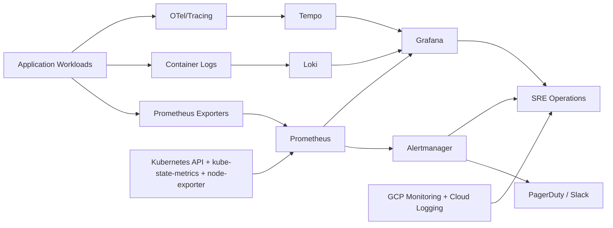

# 03 — Service Connections

## End-to-End Reliability Topology

## Connection Contracts

1. **Metrics path:** App/K8s exporters -> Prometheus -> Grafana + Alertmanager.
2. **Logs path:** Pod/node logs -> Promtail -> Loki -> Grafana Explore.
3. **Traces path:** Instrumented services -> Tempo -> Grafana traces.
4. **Incident path:** Alertmanager -> on-call tools -> runbooks/postmortems.

## Operational Notes

- Use label standards (`service`, `env`, `team`, `severity`) across metrics/logs/traces.
- Keep alert routing and escalation matrix in sync with `04-incident-management/templates/`.
- For GKE, combine in-cluster metrics with Cloud Monitoring alerts for infra + app parity.

