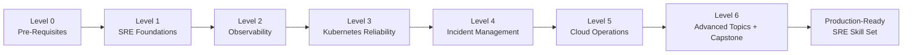
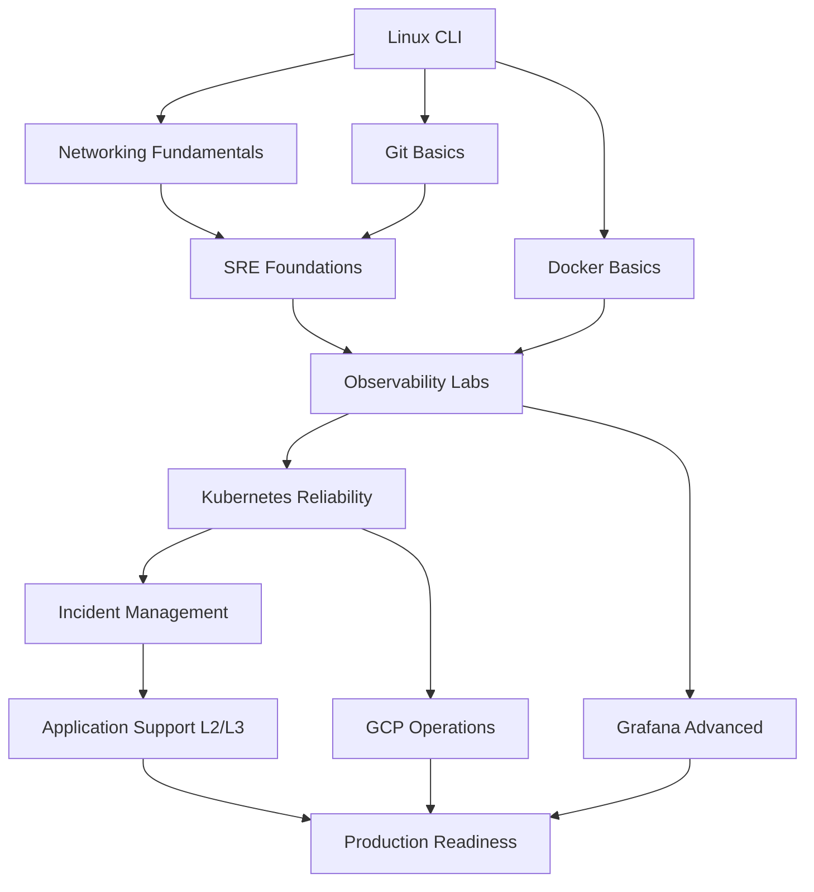

# 10 — Learning Paths (Basic to Advanced)

This module turns the repository into a guided 14-week SRE curriculum. Use it as your main roadmap if you are moving from general infrastructure knowledge to production-grade reliability engineering.

## How to use this roadmap

- Study in order. Each level assumes the previous one is complete.
- Read `theory.md` files first, then complete the labs, then repeat the labs from memory.
- Keep a learning journal with commands, failures, and fixes.
- Re-run `make build` and `make validate` whenever you update notes or complete a milestone.
- Spend more time on troubleshooting than on reading. SRE skill grows through repetition.
- If a topic feels abstract, use the free sandboxes in the resources table before moving on.

## Outcome by the end of this path

By the end of Week 14, you should be able to:

- explain core SRE language without guessing
- navigate Linux systems confidently
- troubleshoot network and application issues methodically
- deploy and use a Prometheus plus Grafana stack
- operate Kubernetes workloads with reliability controls
- run incident response with clear roles and communication
- work with GCP and GKE at an operations level
- build dashboards, alerts, and runbooks that help teams ship safely
- think in terms of availability, risk, toil, and production readiness

## Repository modules used in this roadmap

| Level | Main focus | Primary modules |
|---|---|---|
| Level 0 | Pre-work and tool familiarity | [06-linux-networking](../06-linux-networking/), external fundamentals |
| Level 1 | SRE foundations | [02-sre-principles](../02-sre-principles/), [06-linux-networking](../06-linux-networking/) |
| Level 2 | Observability | [01-monitoring-observability](../01-monitoring-observability/) |
| Level 3 | Kubernetes reliability | [03-kubernetes-reliability](../03-kubernetes-reliability/) |
| Level 4 | Incident management | [04-incident-management](../04-incident-management/) |
| Level 5 | Cloud operations | [05-gcp-operations](../05-gcp-operations/) |
| Level 6 | Advanced operations | [07-grafana-advanced](../07-grafana-advanced/), [08-application-support-l2l3](../08-application-support-l2l3/), [09-production-readiness](../09-production-readiness/) |

## Full progression diagram



## ASCII mental model

```text
Foundations --> Visibility --> Reliability Controls --> Incident Response --> Cloud Ops --> Leadership
Linux/Git       Metrics          K8s patterns            Runbooks             GKE/IAM       Readiness
Networking      Logs             Debugging               Postmortems          Monitoring    Support depth
Docker          Traces           Failure drills          Communication        Governance    Automation
```

---

## Level 0: Pre-Requisites (Before You Start)

Goal: remove beginner friction before you start SRE-specific material.

Expected duration: 3 to 7 days depending on your background.

### Linux command line basics checklist

- [ ] I can move around the filesystem with `pwd`, `ls`, and `cd`.
- [ ] I understand absolute vs relative paths.
- [ ] I can create, copy, move, and delete files with `touch`, `cp`, `mv`, and `rm`.
- [ ] I can read file contents with `cat`, `less`, `head`, and `tail`.
- [ ] I can search text with `grep` and files with `find`.
- [ ] I can edit files with `vi`, `vim`, or `nano`.
- [ ] I can inspect processes with `ps`, `top`, and `htop`.
- [ ] I can inspect disk usage with `df -h` and `du -sh`.
- [ ] I can inspect memory and CPU basics with `free -h`, `uptime`, and `vmstat`.
- [ ] I can use permissions with `chmod`, `chown`, and `sudo`.
- [ ] I can pipe commands together with `|`, `>`, and `>>`.
- [ ] I can read logs with `journalctl` or log files under `/var/log`.

### Networking fundamentals checklist

- [ ] I understand the difference between IP, DNS, TCP, UDP, and HTTP.
- [ ] I can explain what happens when a browser requests a web page.
- [ ] I know the purpose of a port and can identify common ports like 22, 53, 80, and 443.
- [ ] I can test connectivity with `ping`, `curl`, `nc`, or `telnet`.
- [ ] I can query DNS with `dig` or `nslookup`.
- [ ] I can inspect listening sockets with `ss -tulpn`.
- [ ] I can trace network path basics with `traceroute` or `tracepath`.
- [ ] I can explain what latency, packet loss, throughput, and retries mean.
- [ ] I understand the difference between public and private IP ranges.
- [ ] I know the difference between Layer 4 and Layer 7 troubleshooting.

### Git basics checklist

- [ ] I can clone a repository.
- [ ] I can create and switch branches.
- [ ] I can review changes with `git status` and `git diff`.
- [ ] I can stage and commit work with clear messages.
- [ ] I can pull and resolve simple merge conflicts.
- [ ] I understand pull requests at a workflow level.
- [ ] I can read repository history with `git log --oneline --graph`.

### Docker basics checklist

- [ ] I understand images vs containers.
- [ ] I can pull an image with `docker pull`.
- [ ] I can run a container with `docker run`.
- [ ] I can inspect running containers with `docker ps`.
- [ ] I can view logs with `docker logs`.
- [ ] I can stop and remove containers cleanly.
- [ ] I understand published ports and bind mounts.
- [ ] I know why Docker matters for local Kubernetes labs.

### Recommended free resources for each prerequisite area

| Area | Resource | URL | What to use it for |
|---|---|---|---|
| Linux | Linux Journey | https://linuxjourney.com/ | Structured beginner-friendly Linux fundamentals |
| Linux | OverTheWire Bandit | https://overthewire.org/wargames/bandit/ | Command line repetition under pressure |
| Linux | ExplainShell | https://explainshell.com/ | Decode unfamiliar shell commands quickly |
| Networking | SadServers | https://sadservers.com/ | Realistic troubleshooting drills |
| Networking | Killercoda | https://killercoda.com/ | Browser-based Linux and networking labs |
| Git | GitHub Skills | https://skills.github.com/ | Guided Git and GitHub exercises |
| Docker | Play with Docker | https://labs.play-with-docker.com/ | Safe Docker practice without local setup |
| Docker | Killercoda Docker scenarios | https://killercoda.com/ | Container basics and labs |

### Level 0 exit criteria

You are ready for Level 1 when you can do all of the following without step-by-step guidance:

- inspect a Linux host and summarize CPU, memory, disk, and process state
- test whether a service is reachable and identify whether the issue is DNS, TCP, or HTTP
- create a branch, edit a file, and commit the change with Git
- run a container, read its logs, and remove it cleanly

---

## Level 1: SRE Foundations (Weeks 1-2)

Goal: learn the language and mindset that make SRE different from generic systems administration.

Primary modules:

- [02-sre-principles](../02-sre-principles/)
- selected sections from [06-linux-networking](../06-linux-networking/)

### Concepts to master

- **SLI**: the measured signal of user-visible behavior
- **SLO**: the reliability target you commit to internally
- **SLA**: the external promise with business or contractual impact
- **Error budget**: the amount of unreliability a service can spend safely
- **Toil**: repetitive, manual, automatable operational work
- **On-call**: structured responsibility for detection, triage, mitigation, and escalation

### What to study in the repository

From `02-sre-principles`:

- `theory.md`
- `labs/01-define-slis-slos.md`
- `labs/02-error-budget-tracking.md`
- `labs/03-toil-reduction.md`
- `templates/slo-definition.yaml`
- `templates/error-budget-policy.md`

From `06-linux-networking`:

- `theory.md`
- `labs/01-linux-performance.md`
- `labs/02-network-debugging.md`
- `scripts/system-health-check.sh`
- `scripts/network-diag.sh`

### Practice exercises with commands

#### Exercise 1: Inspect your local system like an operator

```bash
uname -a
uptime
free -h
df -h
ps aux | head
```

#### Exercise 2: Check DNS and HTTP behavior

```bash
dig github.com +short
curl -I https://github.com
ss -tulpn | head
```

#### Exercise 3: Review repository health commands

```bash
cd /Users/shasidharreddy_mallu/Site-Reliability-Engineer
make build
make validate
```

#### Exercise 4: Run provided support scripts

```bash
bash 06-linux-networking/scripts/system-health-check.sh
bash 06-linux-networking/scripts/network-diag.sh example.com
```

#### Exercise 5: Practice Git review basics

```bash
git --no-pager status
git --no-pager log --oneline --decorate -5
git --no-pager diff --stat
```

#### Exercise 6: Write one simple SLI and SLO

Use this format in your notes:

```text
Service: sample-api
SLI: successful HTTP requests / total valid HTTP requests
SLO: 99.9% monthly availability
Alert idea: page when short-window burn rate exceeds long-window threshold
```

### Self-assessment checklist

- [ ] I can explain the difference between SLI, SLO, and SLA clearly.
- [ ] I can describe why error budgets help balance speed and stability.
- [ ] I can identify examples of toil in daily operational work.
- [ ] I can explain why on-call quality depends on runbooks and alerts.
- [ ] I can inspect a Linux host and gather basic evidence before escalating.
- [ ] I can troubleshoot whether a problem is system-level or network-level first.
- [ ] I can define one meaningful availability SLI for a real service.

### Level 1 milestone output

By the end of Week 2, produce:

- one sample SLO definition
- one error budget policy draft
- one short list of toil items you would automate first
- one host troubleshooting checklist copied from your practice

---

## Level 2: Observability (Weeks 3-4)

Goal: learn how to make system behavior visible through metrics, logs, traces, dashboards, and alerts.

Primary module:

- [01-monitoring-observability](../01-monitoring-observability/)

### Concepts to master

- metrics and why they are cheap enough for long-term trend analysis
- logs and when raw event context matters more than aggregated signals
- traces and how request path visibility helps isolate latency sources
- Prometheus architecture and pull-based scraping
- PromQL for filtering, aggregation, and rate calculations
- Grafana for dashboarding and correlation
- Alertmanager for routing, grouping, and silencing

### Suggested learning order

1. Read `theory.md`.
2. Complete Prometheus setup.
3. Build one Grafana dashboard from scratch.
4. Write and test at least two alerting rules.
5. Explore logs with Loki.
6. Explore traces and link them back to metrics.

### Hands-on sequence

#### Step 1: Deploy the stack

```bash
cd /Users/shasidharreddy_mallu/Site-Reliability-Engineer
make run-local
kubectl get pods -A
```

#### Step 2: Access Grafana locally

```bash
kubectl port-forward -n monitoring svc/kube-prometheus-stack-grafana 3000:80
kubectl get secret grafana-admin-credentials -n monitoring -o jsonpath='{.data.admin-password}' | base64 --decode; echo
```

#### Step 3: Practice PromQL queries

```promql
up
sum(rate(container_cpu_usage_seconds_total[5m])) by (pod)
histogram_quantile(0.95, sum(rate(http_request_duration_seconds_bucket[5m])) by (le))
(sum(rate(http_requests_total{status=~"5.."}[5m])) / sum(rate(http_requests_total[5m]))) * 100
```

#### Step 4: Build a useful dashboard

Create panels for:

- request rate
- error rate
- p95 latency
- CPU saturation
- memory usage
- pod restarts

#### Step 5: Write alert rules

Start with alerts for:

- target down
- high error rate
- sustained latency increase
- crash looping workload

### Practice checklist

- [ ] I can explain the difference between metrics, logs, and traces.
- [ ] I can deploy the local monitoring stack successfully.
- [ ] I can write basic PromQL with `rate`, `sum`, `avg`, and label filters.
- [ ] I can create a Grafana dashboard that answers a real troubleshooting question.
- [ ] I can describe when to page vs when to ticket an issue.
- [ ] I can find an issue from a dashboard and pivot to logs or traces.
- [ ] I can explain the purpose of Alertmanager grouping and routing.

### ASCII reference: three pillars in context

```text
Request --> Service --> Metric time series --> Alert threshold --> Page/Slack
        \-> Log event stream -------> Search/Context -------> Investigation
        \-> Trace spans -----------> Critical path --------> Latency diagnosis
```

---

## Level 3: Kubernetes Reliability (Weeks 5-7)

Goal: operate workloads in Kubernetes without relying on guesswork.

Primary module:

- [03-kubernetes-reliability](../03-kubernetes-reliability/)

### Concepts to master

- core workloads: Deployments, StatefulSets, DaemonSets, Jobs, and CronJobs
- probes: startup, readiness, and liveness
- resource requests, limits, and QoS classes
- PodDisruptionBudgets and voluntary disruption safety
- autoscaling with HPA and when VPA is appropriate
- network policy basics for service isolation
- rollout safety, rollback, and debugging workflow
- reliability patterns such as graceful shutdown, redundancy, and backoff

### Hands-on lab flow

1. Read the module theory before touching manifests.
2. Apply sample manifests and inspect what each reliability control changes.
3. Break a workload on purpose and watch the platform recover.
4. Capture the debugging commands you use most often.

### Hands-on commands

#### Cluster inspection

```bash
kubectl get nodes
kubectl get pods -A
kubectl get deploy,statefulset,daemonset,job,cronjob -A
```

#### Apply sample reliability manifests

```bash
kubectl apply -f 03-kubernetes-reliability/manifests/pdb-example.yaml
kubectl apply -f 03-kubernetes-reliability/manifests/hpa-example.yaml
kubectl apply -f 03-kubernetes-reliability/manifests/network-policy-default-deny.yaml
```

#### Debugging drill commands

```bash
kubectl describe pod <pod-name>
kubectl logs <pod-name> --previous
kubectl top pod
kubectl get events --sort-by=.metadata.creationTimestamp | tail -20
kubectl rollout status deploy/<deployment-name>
```

#### Failure simulation ideas

- delete a pod and observe whether the controller recreates it
- set an unrealistic readiness path and see how traffic protection behaves
- lower resource limits to trigger throttling or OOMKilled behavior in a safe lab
- test how a default-deny network policy changes traffic flow
- drain or cordon a node in a disposable environment and observe rescheduling

### Practice checklist

- [ ] I can identify the right Kubernetes workload for a service pattern.
- [ ] I can explain the purpose of each probe type.
- [ ] I can read `kubectl describe` output and find relevant failure clues.
- [ ] I can explain how PDBs protect availability during maintenance.
- [ ] I can explain why autoscaling without observability is risky.
- [ ] I can apply a network policy and reason about what traffic it blocks.
- [ ] I can follow a repeatable debugging sequence instead of jumping randomly.

### ASCII reference: control loop thinking

```text
Desired state -> API object -> Controller loop -> Pods/Nodes -> Metrics/Events -> Operator action
```

---

## Level 4: Incident Management (Weeks 8-9)

Goal: learn to lead or support production incidents with calm, structure, and evidence.

Primary module:

- [04-incident-management](../04-incident-management/)

### Concepts to master

- severity levels and business impact
- incident commander responsibilities
- communications lead, operations lead, and subject matter expert roles
- runbooks and why they reduce decision fatigue
- escalation paths and handoff quality
- postmortems, corrective actions, and blameless learning

### Hands-on incident simulation

Use a local or test environment and run one structured exercise.

1. Pick a scenario such as latency spike, pod crash loop, or failed dependency.
2. Set a severity level with a short justification.
3. Name an incident commander and one support role.
4. Use a runbook instead of ad-hoc debugging.
5. Record a timeline with decisions and evidence.
6. Restore service or define mitigation.
7. Write a postmortem with follow-up actions.

### Practice prompts

- What is the customer impact?
- What changed recently?
- What is the current mitigation?
- What evidence do we have vs what are we assuming?
- Who needs to be updated now?
- What action prevents repeat incidents?

### Practice checklist

- [ ] I can assign a severity level based on impact and urgency.
- [ ] I understand what the incident commander should and should not do.
- [ ] I can write a runbook with triggers, checks, mitigation steps, and escalation points.
- [ ] I can produce a clear timeline during an incident.
- [ ] I can write a blameless postmortem focused on system improvement.
- [ ] I can separate immediate remediation from long-term prevention.

### ASCII reference: incident response loop

```text
Detect -> Triage -> Contain -> Mitigate -> Verify -> Communicate -> Postmortem -> Improve
```

---

## Level 5: Cloud Operations (Weeks 10-11)

Goal: become comfortable with cloud-native operational controls in Google Cloud Platform.

Primary module:

- [05-gcp-operations](../05-gcp-operations/)

### Concepts to master

- GCP project structure and service boundaries
- GKE cluster operations basics
- IAM principles and least privilege
- Cloud Monitoring dashboards and alerting
- Cloud Logging queries and troubleshooting
- safe operational changes in managed Kubernetes

### Suggested command practice

```bash
gcloud config list
gcloud projects list
gcloud container clusters list
gcloud container clusters get-credentials <cluster-name> --region <region> --project <project-id>
gcloud projects get-iam-policy <project-id>
```

### Skill targets for this level

- understand how identity and access shape operational safety
- inspect a GKE cluster and connect it to your Kubernetes workflow
- read Cloud Monitoring and Cloud Logging output during investigation
- use scripts carefully for health checks and maintenance operations

### Practice checklist

- [ ] I can explain how IAM roles affect day-to-day operations.
- [ ] I can access a GKE cluster safely and verify the active context.
- [ ] I can find operational evidence in Cloud Monitoring and Cloud Logging.
- [ ] I can describe the risk of draining nodes without pre-checks.
- [ ] I can compare local lab work with managed-cloud operational realities.
- [ ] I know which actions require change control or peer review in production.

---

## Level 6: Advanced Topics (Weeks 12-14)

Goal: connect observability, support depth, and production readiness into one operational model.

Primary modules:

- [07-grafana-advanced](../07-grafana-advanced/)
- [08-application-support-l2l3](../08-application-support-l2l3/)
- [09-production-readiness](../09-production-readiness/)

### Topics to master

- advanced Grafana dashboard design and provisioning
- multi-signal correlation across metrics, logs, and traces
- L2 and L3 support boundaries
- escalation quality and handoff notes
- release readiness checks and operational sign-off
- CI validation, automation, and troubleshooting playbooks

### Capstone project idea

Build a production-style reliability package for a sample service.

#### Capstone scope

- define one service overview and dependencies
- create two SLIs and one SLO target
- build one Grafana dashboard with golden signals
- create at least two alerts with clear severity mapping
- write one incident runbook and one postmortem template instance
- document an L2 to L3 escalation path
- describe release readiness checks and rollback criteria

#### Capstone deliverables

- dashboard screenshots or exported JSON
- alert rule examples
- one short runbook
- one short postmortem
- one support escalation note
- one production readiness checklist

### Practice checklist

- [ ] I can create dashboards as code instead of only clicking in the UI.
- [ ] I can design alerts that are actionable and mapped to ownership.
- [ ] I can distinguish L2 triage work from L3 deep debugging.
- [ ] I can review a release from a reliability perspective.
- [ ] I can connect telemetry, support process, and change safety into one workflow.
- [ ] I can explain how advanced observability supports faster incident resolution.

---

## Skill dependency map



## Weekly study plan diagram

```mermaid
flowchart LR
  W0[Prep<br/>Linux Git Docker Networking] --> W1[Week 1<br/>SLI SLO SLA]
  W1 --> W2[Week 2<br/>Error budgets Toil On-call]
  W2 --> W3[Week 3<br/>Prometheus PromQL]
  W3 --> W4[Week 4<br/>Grafana Alerts Logs Traces]
  W4 --> W5[Week 5<br/>K8s workloads Probes]
  W5 --> W6[Week 6<br/>Resources PDB HPA]
  W6 --> W7[Week 7<br/>Debugging Failure drills]
  W7 --> W8[Week 8<br/>Incident roles Runbooks]
  W8 --> W9[Week 9<br/>Postmortems Escalation]
  W9 --> W10[Week 10<br/>GCP IAM Monitoring]
  W10 --> W11[Week 11<br/>GKE Logging Operations]
  W11 --> W12[Week 12<br/>Grafana advanced]
  W12 --> W13[Week 13<br/>L2 L3 support]
  W13 --> W14[Week 14<br/>Production readiness Capstone]
```



## Week-by-week study plan

| Week | Focus | Repository anchor | Outcome |
|---|---|---|---|
| Prep | Linux, networking, Git, Docker | [06-linux-networking](../06-linux-networking/) plus external resources | Remove tool friction |
| 1 | SLI, SLO, SLA | [02-sre-principles](../02-sre-principles/) | Learn core SRE vocabulary |
| 2 | Error budgets, toil, on-call | [02-sre-principles](../02-sre-principles/) and [06-linux-networking](../06-linux-networking/) | Tie mindset to operator work |
| 3 | Metrics and Prometheus | [01-monitoring-observability](../01-monitoring-observability/) | Understand collection and querying |
| 4 | Grafana, Alertmanager, logs, traces | [01-monitoring-observability](../01-monitoring-observability/) | Build visibility and alerts |
| 5 | K8s workloads and probes | [03-kubernetes-reliability](../03-kubernetes-reliability/) | Understand workload health |
| 6 | Resources, disruptions, autoscaling | [03-kubernetes-reliability](../03-kubernetes-reliability/) | Protect capacity and availability |
| 7 | K8s debugging | [03-kubernetes-reliability](../03-kubernetes-reliability/) | Troubleshoot methodically |
| 8 | Incident command and runbooks | [04-incident-management](../04-incident-management/) | Coordinate response clearly |
| 9 | Postmortems and escalation | [04-incident-management](../04-incident-management/) | Convert incidents into improvements |
| 10 | GCP IAM and monitoring | [05-gcp-operations](../05-gcp-operations/) | Gain cloud operations context |
| 11 | GKE and cloud logging | [05-gcp-operations](../05-gcp-operations/) | Investigate cloud-native issues |
| 12 | Advanced Grafana | [07-grafana-advanced](../07-grafana-advanced/) | Build reusable dashboards and alerts |
| 13 | L2 and L3 support | [08-application-support-l2l3](../08-application-support-l2l3/) | Improve triage and escalation depth |
| 14 | Production readiness | [09-production-readiness](../09-production-readiness/) | Finish capstone and review readiness |

## Curated free practice resources

| Category | Resource name | URL | What you learn | Difficulty |
|---|---|---|---|---|
| Linux | Linux Journey | https://linuxjourney.com/ | Filesystem, permissions, processes, networking basics | Basic |
| Linux | OverTheWire Bandit | https://overthewire.org/wargames/bandit/ | CLI confidence, file inspection, shell habits | Basic |
| Linux | ExplainShell | https://explainshell.com/ | Break down unfamiliar command syntax quickly | Basic |
| Linux / Troubleshooting | SadServers | https://sadservers.com/ | Debugging under realistic failure conditions | Intermediate |
| Kubernetes | Killercoda | https://killercoda.com/ | Browser-based Linux and Kubernetes scenarios | Basic |
| Kubernetes | Play with Kubernetes | https://labs.play-with-k8s.com/ | Quick Kubernetes environment and API exploration | Basic |
| Kubernetes | Kubernetes Official Tutorials | https://kubernetes.io/docs/tutorials/ | Core objects, kubectl, cluster behavior | Basic |
| Kubernetes | Katacoda archived on Killercoda | https://killercoda.com/scenarios | Guided scenarios similar to the classic Katacoda experience | Basic |
| Kubernetes / Labs | KodeKloud free labs | https://kodekloud.com/ | Guided labs for Kubernetes and DevOps workflows | Intermediate |
| Docker | Play with Docker | https://labs.play-with-docker.com/ | Images, containers, ports, and simple multi-node demos | Basic |
| Monitoring | Prometheus Training | https://training.promlabs.com/ | Prometheus architecture, PromQL, alerting | Intermediate |
| Monitoring | PromQL Cheat Sheet | https://promlabs.com/promql-cheat-sheet/ | Query syntax and common PromQL patterns | Intermediate |
| Monitoring | Grafana Play | https://play.grafana.org/ | Real dashboards, Explore mode, panel design ideas | Basic |
| SRE | GitHub Skills | https://skills.github.com/ | Git, pull requests, automation workflow basics | Basic |
| SRE / Terraform | HashiCorp Learn | https://developer.hashicorp.com/terraform/tutorials | Infrastructure as code foundations for ops workflows | Intermediate |
| GCP | Google Cloud Skills Boost free tier | https://cloudskillsboost.google/ | GCP navigation, IAM, Kubernetes, monitoring labs | Intermediate |
| Cloud / General | A Cloud Guru free tier | https://www.pluralsight.com/cloud-guru | Cloud platform walkthroughs and certification-aligned overviews | Intermediate |
| Video | TechWorldWithNana | https://www.youtube.com/@TechWorldwithNana | Visual explanations for Docker, Kubernetes, CI/CD, and observability | Basic |
| Video | DevOps Toolkit | https://www.youtube.com/@DevOpsToolkit | Practical platform engineering and Kubernetes patterns | Intermediate |

## Visual references table

| Topic | Type | URL | How to use it |
|---|---|---|---|
| Kubernetes official architecture | Image and documentation | https://kubernetes.io/docs/concepts/architecture/ | Review control plane and node responsibilities before Level 3 |
| Prometheus architecture diagram | Image and documentation | https://prometheus.io/docs/introduction/overview/ | Understand scrape, storage, and query flow before Level 2 labs |
| Grafana demo environment | Live demo | https://play.grafana.org/ | Explore real dashboards before building your own |
| Play with Docker | Interactive demo | https://labs.play-with-docker.com/ | Practice containers quickly during Level 0 |
| Play with Kubernetes | Interactive demo | https://labs.play-with-k8s.com/ | Experiment with kubectl and cluster objects during Level 3 |
| Killercoda playgrounds | Interactive scenarios | https://killercoda.com/ | Repeat Linux, Docker, and Kubernetes drills safely |
| Asciinema explore | Animated terminal demos | https://asciinema.org/explore | Watch command-line workflows and debugging sessions |

## Inline ASCII references for core concepts

### Availability and error budget

```text
Availability = good events / valid events
Error budget = 100% - SLO target
If SLO = 99.9%, monthly budget = 0.1% unreliability
```

### Golden signals reminder

```text
Latency   -> Is the system slow?
Traffic   -> How much load is the system handling?
Errors    -> Are requests failing?
Saturation-> Are we running out of resources?
```

### Incident communication ladder

```text
Alert -> Triage -> Incident Commander -> SME support -> Mitigation -> Status updates -> Postmortem
```

## Recommended study habits

- Re-do one previous lab every weekend without reading the answer first.
- Keep a personal cheat sheet of Linux, kubectl, PromQL, and gcloud commands.
- Translate every incident or outage story you hear into SLI, detection, mitigation, and prevention.
- Prefer short daily sessions over one long weekly cram session.
- If you are stuck for more than 30 minutes, switch from reading to sandbox practice.

## Final readiness check

You are ready to claim this path as complete when you can say yes to most of the following:

- [ ] I can inspect a host, a container, and a Kubernetes workload confidently.
- [ ] I can define and defend a practical SLO.
- [ ] I can build or debug a Prometheus and Grafana workflow.
- [ ] I can lead a small incident simulation and write a useful postmortem.
- [ ] I can explain GCP and GKE operations at an entry-level practitioner standard.
- [ ] I can support dashboards, alerts, runbooks, and escalation flows.
- [ ] I can review a service for production readiness with reliability in mind.

If not, loop back to the level that still feels shaky. Repetition is normal in SRE learning.
