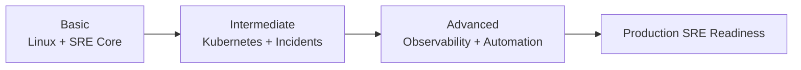
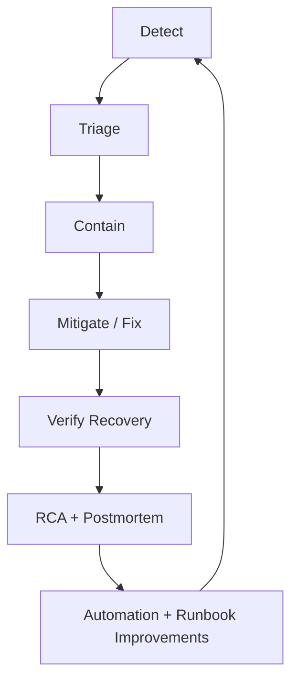

# 10 — Learning Paths (Basic to Advanced)

This track turns the repository into a progressive roadmap from beginner foundations to production-level SRE execution.

## Level 1: Basic (Weeks 1–4)

Goal: Build strong Linux, networking, and SRE fundamentals.

1. [06-linux-networking](../06-linux-networking/) — commands, diagnostics, system behavior
2. [02-sre-principles](../02-sre-principles/) — SLI/SLO/error budget mindset
3. [01-monitoring-observability](../01-monitoring-observability/) — metrics, dashboards, alerts basics

Practice:
- Complete all labs in modules 06 and 02.
- Run local checks with:
  ```bash
  make setup
  make validate
  ```

## Level 2: Intermediate (Weeks 5–8)

Goal: Operate Kubernetes workloads reliably and respond to incidents.

1. [03-kubernetes-reliability](../03-kubernetes-reliability/) — probes, PDB, autoscaling, debugging
2. [04-incident-management](../04-incident-management/) — runbooks, escalation, postmortems
3. [05-gcp-operations](../05-gcp-operations/) — GKE, IAM, cloud monitoring/logging

Practice:
- Create a local cluster and deploy monitoring stack:
  ```bash
  make run-local
  ```
- Simulate one incident and produce a postmortem.

## Level 3: Advanced (Weeks 9–12)

Goal: Connect observability, automation, and release operations at production scale.

1. [07-grafana-advanced](../07-grafana-advanced/) — advanced dashboarding, alert workflows
2. [09-production-readiness](../09-production-readiness/) — setup, release, automation, troubleshooting
3. [08-application-support-l2l3](../08-application-support-l2l3/) — L2/L3 escalation and service ownership

Practice:
- Implement alert routing strategy and escalation matrix.
- Automate quality gates with CI and validation scripts.
- Use troubleshooting playbooks for real failure drills.

## Visual Progression Diagram



## Incident Response Loop (Diagram)



## Images and GIF Learning References

Images:
- Kubernetes architecture: https://kubernetes.io/docs/concepts/architecture/
- Prometheus concepts: https://prometheus.io/docs/introduction/overview/
- Grafana dashboards: https://grafana.com/docs/grafana/latest/dashboards/

GIF / interactive references:
- Killercoda Kubernetes playground: https://killercoda.com/killer-shell-cka/scenario/playground
- Play with Docker labs: https://labs.play-with-docker.com/
- Asciinema terminal recordings: https://asciinema.org/explore

## Free Practice Resource Map

| Topic | Free Resource |
|---|---|
| Linux basics | https://linuxjourney.com/ |
| Linux CLI drills | https://overthewire.org/wargames/bandit/ |
| Kubernetes | https://killercoda.com/ and https://kubernetes.io/docs/tutorials/ |
| Docker | https://labs.play-with-docker.com/ |
| Troubleshooting | https://sadservers.com/ |
| PromQL practice | https://promlabs.com/promql-cheat-sheet/ |
| Grafana hands-on | https://play.grafana.org/ |
| GitHub automation | https://skills.github.com/ |

