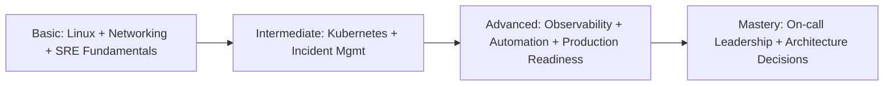
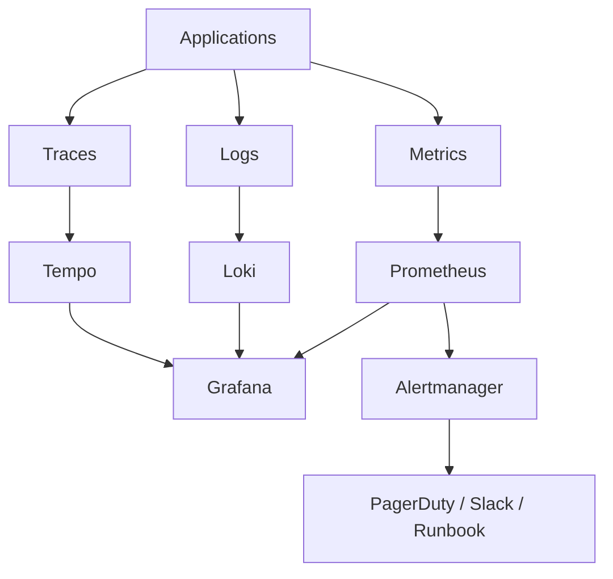

# 🛡️ Site Reliability Engineer (SRE) — Complete Course Kit

> **Theory + Hands-on Labs + Interview Prep + Ready-to-Execute Scripts**
> Aligned to production SRE roles covering on-prem + GCP environments with Grafana/Kubernetes focus.

---

## 📋 Who This Is For

- Engineers preparing for SRE interviews or transitioning into reliability engineering
- DevOps/Platform engineers expanding into observability and incident management
- Teams building or improving monitoring/alerting stacks on Kubernetes + GCP

---

## 🗺️ Course Modules

| # | Module | What You Learn |
|---|--------|----------------|
| 01 | [Monitoring & Observability](01-monitoring-observability/) | Prometheus, PromQL, Grafana, Alertmanager, Loki, Tracing |
| 02 | [SRE Principles](02-sre-principles/) | SLIs, SLOs, Error Budgets, Toil, Chaos Engineering |
| 03 | [Kubernetes Reliability](03-kubernetes-reliability/) | K8s internals, GKE, PDB, HPA/VPA, debugging |
| 04 | [Incident Management](04-incident-management/) | SEV levels, Runbooks, RCA, Postmortems, PagerDuty |
| 05 | [GCP Operations](05-gcp-operations/) | Cloud Monitoring, GKE ops, IAM, Cloud Logging |
| 06 | [Linux & Networking](06-linux-networking/) | Kernel, memory, TCP/IP, DNS, performance tools |
| 07 | [Grafana Advanced](07-grafana-advanced/) | Dashboard design, alerting, provisioning, OnCall |
| 08 | [Application Support L2/L3](08-application-support-l2l3/) | Triage, ServiceNow, L2/L3 workflows |
| 09 | [Production Readiness](09-production-readiness/) | Setup, build/release, architecture connections, automation, troubleshooting |
| 10 | [Learning Paths](10-learning-paths/) | Structured basic-to-advanced progression with visuals and practice plans |
| 📝 | [Interview Prep](interview-prep/) | 250+ Q&A, scenario-based, SRE-specific questions |

---

## 🧰 Repository-Wide Operational Guides

- [SRE Troubleshooting Master Guide](troubleshooting.md) — cross-cutting production triage across Kubernetes, monitoring, GCP, Linux, and releases
- [Full-Stack Incident Scenarios](scenarios.md) — realistic multi-domain incident exercises for tabletop drills and on-call practice
- [Production Config Templates](configs/) — Prometheus, Alertmanager, Loki, Grafana, OpenTelemetry Collector, and local lab configuration

---

## 🔧 Prerequisites

Install these tools before starting labs:

```bash
# macOS
brew install kubectl helm kind terraform python3
brew install --cask google-cloud-sdk

# Verify
kubectl version --client
helm version --short
kind version
gcloud version
```

> **Cluster Options:**
> - **Production/Primary:** GKE Standard (used throughout production labs) — `gcloud container clusters create`
> - **Local lab parity:** `kind` (Kubernetes-in-Docker) — mirrors production API server, supports multi-node, runs on your laptop
> - **On-prem:** Any CNCF-conformant cluster (RKE2, K3s with HA etcd, Tanzu, OpenShift)
>
> ⚠️ minikube is intentionally excluded — it uses a non-standard single-node setup with incomplete CNI/CSI support that does not reflect real production environments.

---

## 🚀 Quick Start

```bash
# 1. Local prerequisite check
make setup

# 2A. Local multi-node lab (kind + deploy)
make run-local

# 2B. Or deploy to existing current context (GKE/on-prem)
make deploy

# 3. Build + validate repository content
make build
make validate

# 4. Access Grafana (temporary local access)
kubectl port-forward -n monitoring svc/kube-prometheus-stack-grafana 3000:80
kubectl get secret grafana-admin-credentials -n monitoring \
  -o jsonpath='{.data.admin-password}' | base64 --decode; echo
```

---

## 🧭 Learning Path (Basic → Advanced)

| Level | Focus | Start Here |
|---|---|---|
| Basic | Linux, networking, core monitoring concepts, SRE foundations | [10-learning-paths](10-learning-paths/) + [06-linux-networking](06-linux-networking/) |
| Intermediate | Kubernetes reliability, incident response, production workflows | [03-kubernetes-reliability](03-kubernetes-reliability/) + [04-incident-management](04-incident-management/) |
| Advanced | Multi-signal observability, automation, release governance, platform reliability | [01-monitoring-observability](01-monitoring-observability/) + [07-grafana-advanced](07-grafana-advanced/) + [09-production-readiness](09-production-readiness/) |

---

## 🖼️ Visual Learning (Images + Diagrams + GIF References)

  





GIF-based walkthrough references:
- [Kubernetes demos on Killercoda](https://killercoda.com/killer-shell-cka/scenario/playground)
- [Docker walkthroughs (Play with Docker)](https://labs.play-with-docker.com/)
- [Linux terminal walkthrough collection](https://asciinema.org/explore)

---

## 🧪 Free Practice References (Hands-on)

Core sandboxes and labs:
- [Killercoda](https://killercoda.com/) — free browser-based Kubernetes, Docker, Linux scenarios
- [Play with Docker](https://labs.play-with-docker.com/) — free Docker playground
- [Katacoda archive mirror on Killercoda](https://killercoda.com/scenarios) — scenario-driven hands-on labs
- [KodeKloud free community labs](https://kodekloud.com/community/) — community exercises and walkthroughs

Kubernetes and cloud-native:
- [Kubernetes official interactive tutorials](https://kubernetes.io/docs/tutorials/)
- [Kubernetes By Example](https://kubernetesbyexample.com/)
- [Prometheus training](https://training.promlabs.com/training/) and [PromQL cheat sheet](https://promlabs.com/promql-cheat-sheet/)
- [Grafana Play](https://play.grafana.org/) — free live Grafana environment

Linux, scripting, networking, troubleshooting:
- [OverTheWire Bandit](https://overthewire.org/wargames/bandit/) — Linux command-line fundamentals
- [SadServers](https://sadservers.com/) — real troubleshooting scenarios
- [Linux Journey](https://linuxjourney.com/) — beginner-to-intermediate Linux path
- [ExplainShell](https://explainshell.com/) — understand complex shell commands

DevOps, GitHub, CI/CD:
- [GitHub Skills](https://skills.github.com/) — free guided labs for GitHub and automation
- [Awesome Actions](https://github.com/sdras/awesome-actions) — GitHub Actions examples
- [HashiCorp Learn](https://developer.hashicorp.com/terraform/tutorials) — Terraform tutorials (free)

---

## 🎯 Job Description Alignment

| JD Requirement | Primary Module | Secondary Module |
|---|---|---|
| Grafana dashboards & alerting | 07-grafana-advanced | 01-monitoring-observability |
| Prometheus & observability stack | 01-monitoring-observability | — |
| SLIs, SLOs, error budgets | 02-sre-principles | — |
| Kubernetes (GKE + on-prem) | 03-kubernetes-reliability | 05-gcp-operations |
| Incident response, RCA, postmortems | 04-incident-management | — |
| GCP operations | 05-gcp-operations | — |
| Linux systems & troubleshooting | 06-linux-networking | — |
| L2/L3 application support | 08-application-support-l2l3 | 04-incident-management |
| On-call rotation | 04-incident-management | 07-grafana-advanced |

---

## 📌 ATS Keywords

`Site Reliability Engineering` · `SRE` · `Grafana` · `Prometheus` · `PromQL` · `Alertmanager`
`Kubernetes` · `GKE` · `Google Cloud Platform` · `GCP` · `Observability` · `Monitoring`
`SLI` · `SLO` · `Error Budget` · `Incident Management` · `On-Call` · `PagerDuty`
`ServiceNow` · `Linux` · `Bash` · `Python` · `Loki` · `Distributed Tracing`
`Helm` · `Terraform` · `Docker` · `CI/CD` · `DevOps` · `Platform Engineering`
`kube-prometheus-stack` · `Thanos` · `Grafana OnCall` · `RCA` · `Postmortem`
`High Availability` · `Reliability Engineering` · `L2/L3 Support` · `On-premises`

---

## 📂 Repository Structure

```
.
├── 01-monitoring-observability/   # Metrics, logs, traces
├── 02-sre-principles/             # SLIs, SLOs, error budgets
├── 03-kubernetes-reliability/     # K8s reliability patterns
├── 04-incident-management/        # Incidents, runbooks, postmortems
├── 05-gcp-operations/             # GCP + GKE operations
├── 06-linux-networking/           # Linux internals + networking
├── 07-grafana-advanced/           # Advanced Grafana
├── 08-application-support-l2l3/   # L2/L3 support workflows
├── 09-production-readiness/       # Setup, build, connections, automation, troubleshooting
├── 10-learning-paths/             # Basic-to-advanced roadmap with visual guides
├── interview-prep/                # 250+ interview Q&A
├── scripts/                       # Bootstrap + deploy + validation automation
├── configs/                       # Kind cluster and other platform configs
├── .github/workflows/             # CI automation
└── Makefile                       # Standard command entrypoints
```
